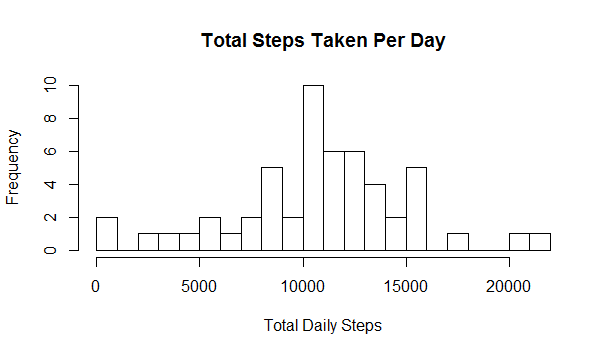
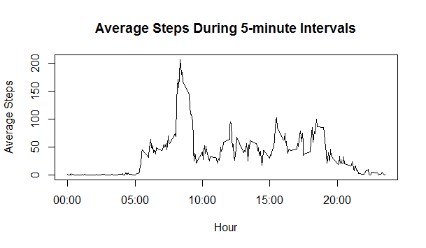
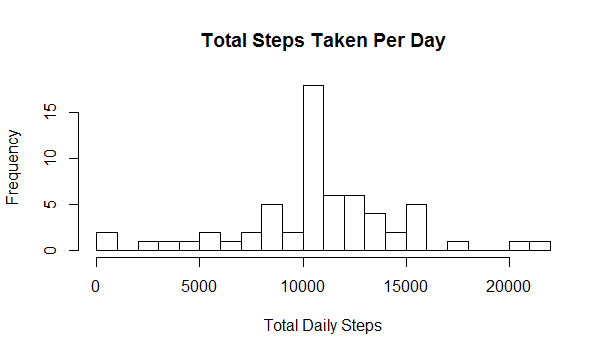
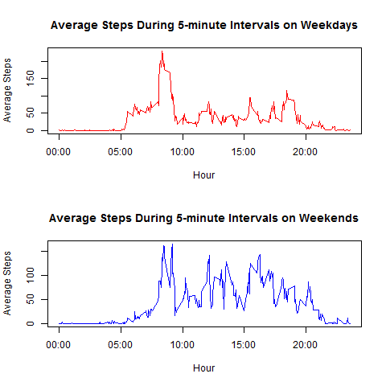

# Reproducible Research: Peer Assessment 1
Reproduced by Irvin Lim

## Loading and preprocessing the data
```r

data <- read.csv("activity.csv")
```


## What is mean total number of steps taken per day?
For this part of the assignment, you can ignore the missing values in the dataset.

1. Calculate the total number of steps taken per day.

2. Make a histogram of the total number of steps taken each day.

```r
hist(tapply(data$steps, data$date, sum), xlab = "Total Daily Steps", breaks = 20, 
     main = "Total Steps Taken Per Day")
total_steps_daily <- as.numeric(tapply(data$steps, data$date, sum))
```


3. Calculate and report the mean and median of the total number of steps taken per day

```r
mean_steps <- mean(total_steps_daily, na.rm = TRUE)
```
```
# [1] 10766
```

```r
median_steps <- median(total_steps_daily, na.rm = TRUE)
```
```
# [1] 10765
```

## What is the average daily activity pattern?
1. Make a time series plot (i.e. type = "l") of the 5-minute interval (x-axis) and the average number of steps taken, averaged across all days (y-axis)

```r
data$interval <- as.factor(as.character(data$interval))
mean_interval <- as.numeric(tapply(data$steps, data$interval, mean, na.rm = TRUE))
intervals <- data.frame(intervals = as.numeric(levels(data$interval)), mean_interval)
intervals <- intervals[order(intervals$intervals), ]
labels <- c("00:00", "05:00", "10:00", "15:00", "20:00")
labels_at <- seq(0, 2000, 500)
plot(intervals$intervals, intervals$mean_interval, type = "l", main = "Average Steps During 5-minute Intervals", 
     ylab = "Average Steps", xlab = "Hour", xaxt = "n")
axis(side = 1, at = labels_at, labels = labels)
```

2. Which 5-minute interval, on average across all the days in the dataset, contains the maximum number of steps?


```r
sort_intervals <- intervals[order(intervals$mean_interval, decreasing = TRUE), ]
head(sort_intervals)
```

```r
    intervals mean_interval
272       835      206.1698
273       840      195.9245
275       850      183.3962
274       845      179.5660
271       830      177.3019
269       820      171.1509
```

```r
max_interval <- sort_intervals$intervals[1[1]]
max_interval
```

```
# [1] 835
```
The 5-minute interval with the highest average number of steps corresponds to the interval between 8:35AM and 8:40AM.


## Imputing missing values
Note that there are a number of days/intervals where there are missing values (coded as NA). The presence of missing days may introduce bias into some calculations or summaries of the data.

1. Calculate and report the total number of missing values in the dataset (i.e. the total number of rows with NAs)
```r
dim(data[is.na(data$steps), ])[1]
```

```
# [1] 2304
```
2. Devise a strategy for filling in all of the missing values in the dataset. The strategy does not need to be sophisticated. For example, you could use the mean/median for that day, or the mean for that 5-minute interval, etc.

The total number of missing values in the dataset (NA) is 2304.
The strategy for filling in the missing values is to change "NA" to the mean value of that 5-minute interval.

3. Create a new dataset that is equal to the original dataset but with the missing data filled in.

```r
steps <- vector()
for (i in 1:dim(data)[1]) {
    if (is.na(data$steps[i])) {
        steps <- c(steps, intervals$mean_interval[intervals$intervals == data$interval[i]])
    } else {
        steps <- c(steps, data$steps[i])
    }
}

no_na_data <- data.frame(steps = steps, date = data$date, interval = data$interval)
```
4. Make a histogram of the total number of steps taken each day and Calculate and report the mean and median total number of steps taken per day. Do these values differ from the estimates from the first part of the assignment? What is the impact of imputing missing data on the estimates of the total daily number of steps?

```r
hist(tapply(no_na_data$steps, no_na_data$date, sum), xlab = "Total Daily Steps", breaks = 20, main = "Total Steps Taken Per Day")
```



```r
total_steps_daily <- as.numeric(tapply(no_na_data$steps, 
                                       no_na_data$date, sum))
mean_steps <- mean(total_steps_daily)
median_steps <- median(total_steps_daily)
```
```r
mean_steps
```
```
# [1] 10766
```
```r
median_steps
```
```
# [1] 10766
```
The values differ slightly from the values from the first part of the assignment. The impact of imputing missing data on the estimates of the total daily number of steps is minimal.

## Are there differences in activity patterns between weekdays and weekends?

For this part the weekdays() function may be of some help here. Use the dataset with the filled-in missing values for this part.

1. Create a new factor variable in the dataset with two levels - "weekday" and "weekend" indicating whether a given date is a weekday or weekend day.

```r
no_na_data$daytype <- c("weekend", "weekday", "weekday", 
                                            "weekday", "weekday", "weekday", "weekend")[as.POSIXlt(no_na_data$date)$wday + 
                                                1]
no_na_data$daytype <- as.factor(no_na_data$daytype)

weekday <- no_na_data[no_na_data$daytype == 
    "weekday", ]
weekend <- no_na_data[no_na_data$daytype == 
    "weekend", ]
weekday_means <- as.numeric(tapply(weekday$steps, weekday$interval, mean))
weekend_means <- as.numeric(tapply(weekend$steps, weekend$interval, mean))

intervals_daytype <- data.frame(intervals = as.numeric(levels(data$interval)), 
                                 weekday_means, weekend_means)
intervals_daytype <- intervals_daytype[order(intervals_daytype$intervals), 
                                         ]
```
2. Make a panel plot containing a time series plot (i.e. type = "l") of the 5-minute interval (x-axis) and the average number of steps taken, averaged across all weekday days or weekend days (y-axis). 

```r
png('plot4.png', width=480, height=480)
par <- par(mfrow = c(2, 1))
plot(intervals_daytype$intervals, intervals_daytype$weekday_means, type = "l", 
     col = "red", ylab = "Average Steps", xlab = "Hour", main = "Average Steps During 5-minute Intervals on Weekdays", 
     xaxt = "n")
axis(side = 1, at = labels_at, labels = labels)
plot(intervals_daytype$intervals, intervals_daytype$weekend_means, type = "l", 
     col = "blue", ylab = "Average Steps", xlab = "Hour", main = "Average Steps During 5-minute Intervals on Weekends", 
     xaxt = "n")
axis(side = 1, at = labels_at, labels = labels)
dev.off()
```


